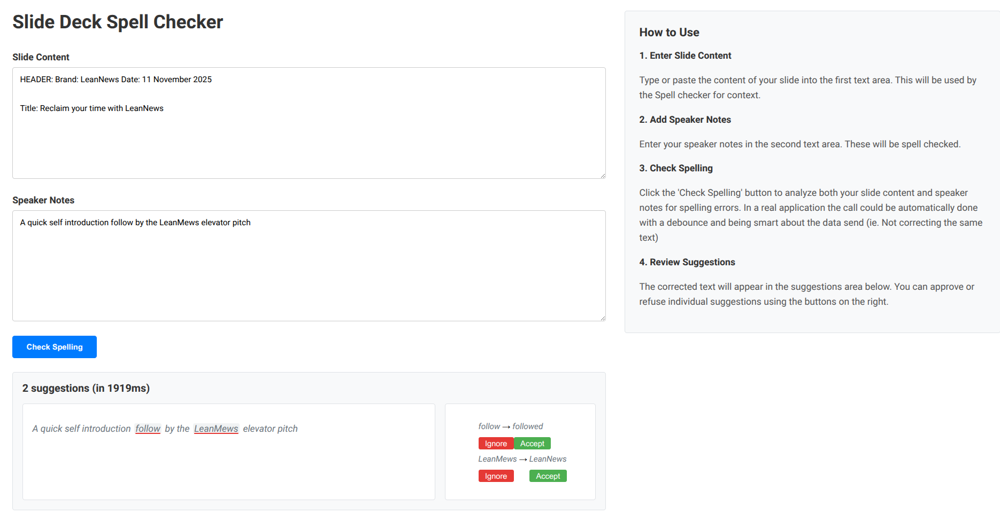

# Spell Checker

A full-stack Clojure/ClojureScript application to prototype an AI spell check for Speaker Notes, that uses the Speaker Slide as context.


## Technology Stack

### Backend
- **Reitit & friends** - For the HTTP part
- **clj-sac** - My little LLM library to read prompt files and use Gemini and Mistral

### Frontend
- **Shadow-CLJS**
- **UIX** - I usually use Reagent+re-frame but I went for uix to brush up my knowledge of it
- **Reframe** - For wiring and state management

## Development Setup

### Prerequisites

- Java 11 or higher
- Clojure CLI tools
- Node.js and npm

### Install Dependencies

```bash
# Install npm dependencies
npm install
```

### Development Workflow

#### Terminal 1: Start the Backend Server

Set a Gemini key under the environment variable `GEMINI_API_KEY`.
If you don't have a key, you can create one here: aistudio.google.com.


```bash
clojure -M -m spell-checker.core
```

#### Terminal 2: Start the Frontend Development Build

```bash
npx shadow-cljs watch app
```

#### Access the Application

Open your browser to http://localhost:3000




## REPL Development

### Backend REPL

No component library is used for this prototype. It uses `defonce` for the server.
For starting a repl:

```bash
clojure -M:dev:test -m nrepl.cmdline
```

Then connect your favorite editor to the nREPL server and run the `(spell-checker.core/-main)`

## Run the tests
```bash
clojure -X:test
```

## Project Features


A more detail documentation is available [here](documentation/doc.md)

### Simple UX

This prototype uses vanilla CSS and text area with no external dependencies.
It also follows classic CLJS React and Reitit layout.

### AI

It uses gemini-2.5-flash as LLM. I tried gemini-2.5-flash-lite but it did not work in all cases.
The latency with gemini-2.5-flash is between 2 and 8 seconds; it requires UX thinking to not let the user being block for that long.

## License

Copyright Julien Bille © 2025
